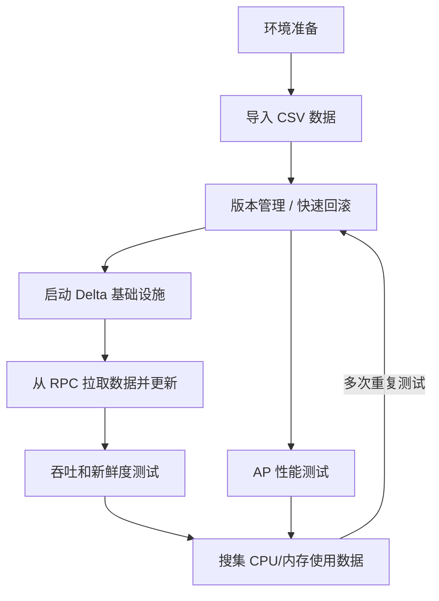

# Delta Lake 测试流程

本文档参考：

- `/home/antio2/projects/retina-deltalake/README.md`
- `/home/antio2/文档/note/数据系统/大数据与计算/数据湖仓/Lance/Lance测试流程.md`

目标是为 Delta Lake 的功能、版本管理、流式更新、吞吐、新鲜度、AP 查询与资源使用测试提供一套统一流程。

## overall workflow



## 1. 环境准备

需要准备两层环境：

1. Delta Lake 基础设施
   - MinIO
   - Hive Metastore
   - Trino
   - 可选 Flink Delta writer
2. Pixels CDC -> Spark merge 运行环境
   - Java 17
   - Spark 3.5.x
   - `pixels-spark` shaded jar
   - metadata service
   - Pixels RPC service

建议先完成：

```bash
cd /home/antio2/projects/retina-deltalake
./scripts/install-native.sh
./scripts/build-job.sh
./scripts/start-native.sh
```

然后再准备 `pixels-spark`：

```bash
cd /home/antio2/projects/pixels-spark
./scripts/build-package.sh
```

## 2. 导入 CSV 数据

如果是做 Delta Lake 基础验证，可以沿用 `retina-deltalake` 中的演示数据：

```bash
cd /home/antio2/projects/retina-deltalake
./scripts/reset-demo-data.sh
./scripts/submit-flink-job.sh
./scripts/register-table.sh
```

如果是做 Pixels CDC 驱动的 Delta merge 测试，则建议：

1. 准备一张在 metadata service 中可见、并且主键已定义的源表
2. 确认 Pixels RPC 服务能对这张表和目标 bucket 拉到 CDC 记录
3. 用 `pixels-spark` 的 source smoke test 先验证是否有数据

例如：

```bash
cd /home/antio2/projects/pixels-spark
mvn -q -DskipTests \
  -Dexec.mainClass=io.pixelsdb.spark.app.PixelsCustomerPullTest \
  -Dexec.args="localhost 9091 pixels_bench savingaccount 0" \
  org.codehaus.mojo:exec-maven-plugin:3.5.0:java
```

## 3. 版本管理 / 快速回滚

Delta Lake 的版本管理核心在 `_delta_log`。

测试前建议始终保证目标 Delta 路径是干净的，避免混入历史批次。

常见做法：

1. 本地测试：直接删目标路径和 checkpoint 路径
2. MinIO / S3 测试：用对象存储命令做目录备份与恢复
3. Delta 表验证：记录当前版本号，必要时用 time travel 或直接恢复对象目录

对于 `pixels-spark`，建议每轮实验都切换 checkpoint 目录，例如：

```text
/tmp/pixels-spark-savingaccount-ckpt-run1
/tmp/pixels-spark-savingaccount-ckpt-run2
```

## 4. 启动 Delta 基础设施

如果实验依赖 Trino / Hive Metastore 查询：

```bash
cd /home/antio2/projects/retina-deltalake
./scripts/start-native.sh
./scripts/status-native.sh
```

建议确认以下端口：

- MinIO API: `127.0.0.1:9000`
- MinIO Console: `127.0.0.1:9001`
- Hive Metastore: `127.0.0.1:9083`
- Flink UI: `127.0.0.1:8081`
- Trino: `127.0.0.1:8080`

## 5. 从 RPC 拉取数据并更新

`pixels-spark` 的主链路是：

`Pixels RPC -> Spark Structured Streaming -> foreachBatch -> Delta MERGE`

标准运行方式：

```bash
cd /home/antio2/projects/pixels-spark
./scripts/run-delta-merge.sh \
  --database pixels_bench \
  --table savingaccount \
  --buckets 0 \
  --rpc-host localhost \
  --rpc-port 9091 \
  --metadata-host localhost \
  --metadata-port 18888 \
  --target-path /tmp/pixels-spark-savingaccount-delta \
  --checkpoint-location /tmp/pixels-spark-savingaccount-ckpt \
  --trigger-mode once
```

默认 delete 语义是：

- `hard delete`

也就是：

- Delta 表 schema 与源 schema 保持一致
- delete 命中后直接物理删除

如果实验明确需要软删除，再显式指定：

```text
--delete-mode soft
```

## 6. 吞吐和新鲜度测试

吞吐测试重点关注：

1. 单轮 merge 耗时
2. records/sec
3. 每轮新写入 / 更新 / 删除行数

新鲜度测试重点关注：

1. 源事件产生时间
2. Delta merge 完成时间
3. Trino 查询可见时间

当前仓库可直接用的脚本：

```bash
cd /home/antio2/projects/pixels-spark
./scripts/benchmark-delta-merge.sh \
  3 \
  pixels_bench \
  savingaccount \
  0 \
  localhost \
  9091 \
  localhost \
  18888 \
  /tmp/pixels-spark-savingaccount-delta \
  /tmp/pixels-spark-benchmark-ckpt \
  --trigger-mode once
```

这会输出：

- `run=<n>`
- `start_ts=<unix_ts>`
- `elapsed_seconds=<n>`

## 7. AP 性能测试

AP 测试的目标不是 Spark merge，而是 Delta 表落地后对查询层的影响。

建议方法：

1. 先固定一轮 Delta 数据导入 / merge
2. 再用 Trino 对 Delta 表执行单查询测试
3. 对不同版本或不同数据规模重复测试

对 `retina-deltalake` 示例，可先注册表再跑查询：

```bash
cd /home/antio2/projects/retina-deltalake
./scripts/register-table.sh
```

后续如需正式 AP benchmark，建议复用你现有的 Trino JDBC benchmark 工具链。

## 8. 资源使用数据采集

建议每轮实验都同步采：

- CPU
- RSS / heap
- IO
- 网络
- Spark driver / executor 日志
- Trino / HMS 日志

最小化方式：

```bash
top
htop
pidstat -r -u -d 1
```

如果要做正式实验，建议：

1. 固定采样间隔
2. 每轮实验单独存日志
3. 将运行参数、目标路径、checkpoint 路径、时间戳一起记录

## 9. 每轮实验后的检查项

每一轮都建议至少验证：

1. Delta 表是否仍可读
2. 主键是否重复
3. 目标 schema 是否符合预期
4. delete 语义是否符合当前模式

当前仓库已有的验证脚本：

```bash
./scripts/preview-delta-table.sh /tmp/pixels-spark-savingaccount-delta 5 local[1]
./scripts/check-delta-primary-key.sh localhost 18888 pixels_bench savingaccount /tmp/pixels-spark-savingaccount-delta local[1]
./scripts/acceptance-delta-merge.sh \
  pixels_bench savingaccount 0 localhost 9091 localhost 18888 \
  /tmp/pixels-spark-savingaccount-delta \
  /tmp/pixels-spark-savingaccount-ckpt
```

判断标准：

- `primary_keys` 不为空
- `row_count == distinct_pk_count`

## 10. 推荐实验顺序

建议按下面顺序推进：

1. 跑原生 Delta 基础设施验证
2. 跑 Pixels RPC source smoke test
3. 跑一次 `Trigger.Once()` 的 Delta merge
4. 做主键一致性校验
5. 做 benchmark 重复运行
6. 插入 Trino AP 查询
7. 收集 CPU / 内存 / 日志
8. 回滚 Delta 目标目录或切换 checkpoint，开始下一轮

## 11. 当前仓库中的文档分工

- [README.md](/home/antio2/projects/pixels-spark/README.md)：`pixels-spark` 的构建、merge、脚本与验证说明
- [DELTA_LAKE_NATIVE_DEPLOYMENT.md](/home/antio2/projects/pixels-spark/docs/DELTA_LAKE_NATIVE_DEPLOYMENT.md)：原生 Delta/Flink/Trino/MinIO 部署参考
- [DELTA_LAKE_TEST_FLOW.md](/home/antio2/projects/pixels-spark/docs/DELTA_LAKE_TEST_FLOW.md)：Delta Lake 的完整测试流程
