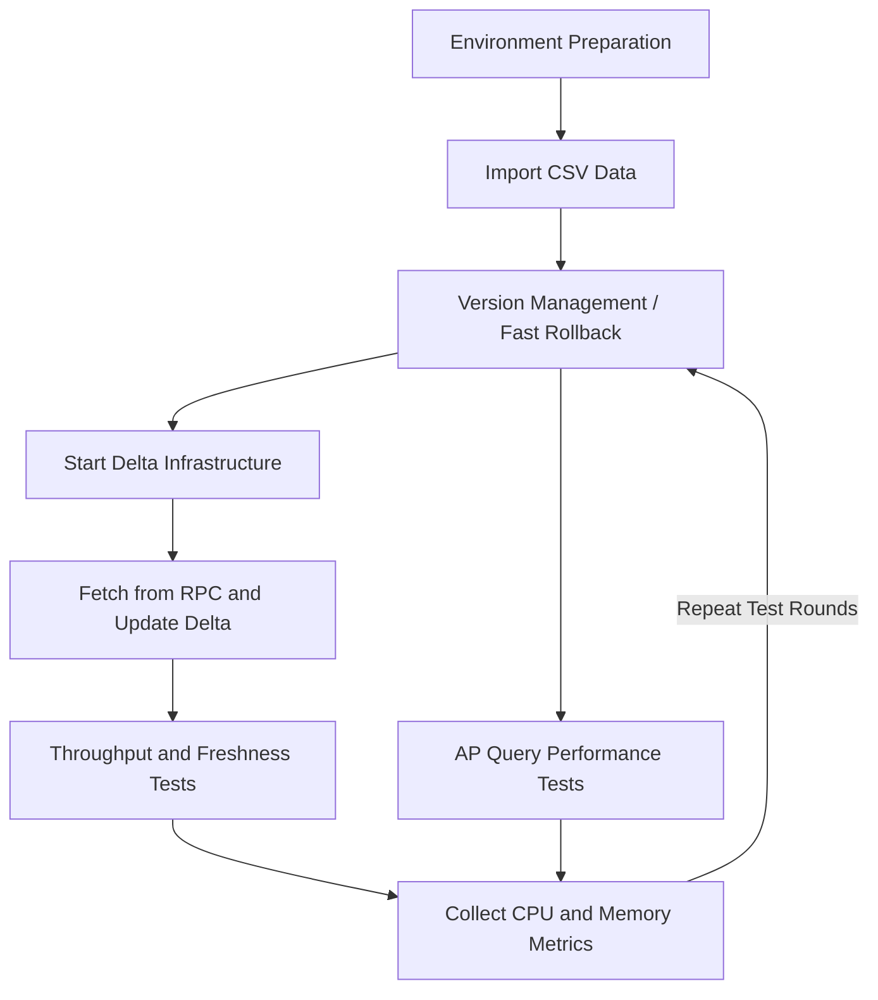

# Delta Lake Test Flow

This document defines a repeatable test workflow for Delta Lake experiments around deployment, ingestion, merge, validation, benchmark runs, and query checks.

It is modeled after the existing Lance test flow used in the same research environment, but adapted to the Delta Lake stack used by `pixels-spark`.

## Workflow



## 1. Environment Preparation

Prepare two layers:

1. Delta infrastructure
2. Pixels CDC merge runtime

Delta infrastructure typically includes:

- object storage
- Hive Metastore
- Trino
- optional Flink Delta writer

Pixels CDC merge runtime includes:

- Java 17
- Spark 3.5.x
- the shaded `pixels-spark` JAR
- a Pixels RPC service
- a Pixels metadata service

Recommended first steps:

```bash
./scripts/build-package.sh
```

Make sure the external Delta infrastructure is already available before running large-scale tests.

## 2. Import CSV Data

This step imports the benchmark CSV files from `pixels-benchmark/Data_1x` into Delta tables.

Included tables:

- `customer`
- `company`
- `savingAccount`
- `checkingAccount`
- `transfer`
- `checking`
- `loanapps`
- `loantrans`

Excluded from this step:

- `blocked_checking.csv`
- `blocked_transfer.csv`

Reference files:

- DDL template: `pixels-benchmark/conf/ddl_deltalake.sql`
- Spark SQL load template: `pixels-benchmark/conf/load_data_deltalake.sql`
- Executable import script: [scripts/import-benchmark-csv-to-delta.sh](../scripts/import-benchmark-csv-to-delta.sh)
- S3 import script: [scripts/import-benchmark-csv-to-delta-s3.py](../scripts/import-benchmark-csv-to-delta-s3.py)
- Project config file: [etc/pixels-spark.properties](../etc/pixels-spark.properties)
- Trino Delta catalog template: [etc/trino-delta_lake.properties.example](../etc/trino-delta_lake.properties.example)

Example import command:

```bash
./scripts/import-benchmark-csv-to-delta.sh \
  /path/to/pixels-benchmark/Data_1x \
  /tmp/pixels-benchmark-deltalake/data_1x \
  local[1]
```

Expected result:

- one Delta table directory per benchmark table
- a `_delta_log` directory under each table path
- a persistent `_pixels_bucket_id` column in every imported table
- imported row counts consistent with the source CSV files

The current import logic computes:

```text
_pixels_bucket_id = pmod(hash(pk), x)
```

Where:

- `x` comes from `etc/pixels-spark.properties`
- the property name is `pixels.spark.delta.hash-bucket.count`

Before re-importing, confirm this setting:

```properties
pixels.spark.delta.hash-bucket.count=16
```

Example local re-import:

```bash
./scripts/import-benchmark-csv-to-delta.sh \
  /path/to/pixels-benchmark/Data_1x \
  /tmp/pixels-benchmark-deltalake/data_1x \
  local[1]
```

Example single-table S3 re-import:

```bash
export PIXELS_SPARK_CONFIG=/home/ubuntu/disk1/projects/pixels-spark/etc/pixels-spark.properties

"$SPARK_HOME/bin/spark-submit" \
  --master local[4] \
  --driver-memory 20g \
  --conf spark.sql.extensions=io.delta.sql.DeltaSparkSessionExtension \
  --conf spark.sql.catalog.spark_catalog=org.apache.spark.sql.delta.catalog.DeltaCatalog \
  --conf spark.sql.shuffle.partitions=32 \
  --conf spark.default.parallelism=32 \
  --conf spark.hadoop.fs.s3a.impl=org.apache.hadoop.fs.s3a.S3AFileSystem \
  --conf spark.hadoop.fs.s3a.aws.credentials.provider=com.amazonaws.auth.EnvironmentVariableCredentialsProvider \
  --conf spark.hadoop.fs.s3a.endpoint=s3.us-east-2.amazonaws.com \
  --conf spark.hadoop.fs.s3a.connection.ssl.enabled=true \
  --conf spark.hadoop.fs.s3a.path.style.access=false \
  ./scripts/import-benchmark-csv-to-delta-s3.py \
  /home/ubuntu/disk1/hybench_sf1000 \
  s3a://home-zinuo/deltalake/hybench_sf1000 \
  savingAccount
```

To re-import the full `sf1000` dataset:

```bash
./scripts/run-import-hybench-sf1000.sh
```

To re-import the full `sf10` dataset into S3:

```bash
./scripts/run-import-hybench-sf10.sh
```

You can also pass the source and target paths explicitly:

```bash
./scripts/run-import-hybench-sf10.sh \
  /home/ubuntu/disk1/hybench_sf10 \
  s3a://home-zinuo/deltalake/hybench_sf10
```

To override the hash-bucket count temporarily:

```bash
export PIXELS_IMPORT_HASH_BUCKET_COUNT=32
```

Validated row counts for `Data_1x`:

- `customer`: `300000`
- `company`: `2000`
- `savingAccount`: `302000`
- `checkingAccount`: `302000`
- `transfer`: `6000000`
- `checking`: `600000`
- `loanapps`: `600000`
- `loantrans`: `600000`

## 3. Version Management and Fast Rollback

Delta Lake uses `_delta_log` for versioned table state.

Before each experiment round:

- clean or rotate the target Delta path
- clean or rotate the checkpoint directory
- record the exact target path, checkpoint path, and run timestamp

Recommended practice:

- use a fresh checkpoint path for every benchmark round
- use isolated Delta target paths for different scenarios

Example:

```text
/tmp/pixels-spark-savingaccount-delta-run1
/tmp/pixels-spark-savingaccount-delta-run2
/tmp/pixels-spark-savingaccount-ckpt-run1
/tmp/pixels-spark-savingaccount-ckpt-run2
```

## 4. Start Delta Infrastructure

Before running AP validation or cross-engine checks, confirm that the Delta infrastructure is running:

- object storage
- Hive Metastore
- Trino

Typical checks include:

- storage endpoint reachable
- metastore reachable
- query engine reachable

If you re-import Delta tables, especially when you:

- run an overwrite import
- change the partition layout
- change `_pixels_bucket_id`
- switch to a new target table path

you usually need to re-register the table metadata in Trino.

## 5. Register Delta Tables in Trino

Recommended schema:

- `delta_lake.hybench_sf10`

Before registering, confirm that the Trino `delta_lake` catalog:

- has `delta.register-table-procedure.enabled=true`
- can access Hive Metastore
- can access S3

Recommended template:

- [etc/trino-delta_lake.properties.example](../etc/trino-delta_lake.properties.example)

If the current Trino `delta_lake.properties` does not include S3 settings, registration may fail with:

```text
No factory for location: s3://home-zinuo/deltalake/hybench_sf10/customer/_delta_log
```

This means the current Trino instance cannot read the Delta log on S3. In that case:

- add S3 settings to the current `delta_lake.properties` and restart Trino
- or start a temporary Trino instance with S3 enabled only for registration

Example single-table registration:

```bash
/home/ubuntu/disk1/opt/trino-cli/trino \
  --server http://127.0.0.1:8080 \
  --execute "CREATE SCHEMA IF NOT EXISTS delta_lake.hybench_sf10;
             DROP TABLE IF EXISTS delta_lake.hybench_sf10.customer;
             CALL delta_lake.system.register_table(
               schema_name => 'hybench_sf10',
               table_name => 'customer',
               table_location => 's3://home-zinuo/deltalake/hybench_sf10/customer'
             )"
```

Example full `sf10` re-registration:

```bash
/home/ubuntu/disk1/opt/trino-cli/trino --server http://127.0.0.1:8080 \
  --execute "CREATE SCHEMA IF NOT EXISTS delta_lake.hybench_sf10"

for table_name in customer company savingaccount checkingaccount transfer checking loanapps loantrans; do
  /home/ubuntu/disk1/opt/trino-cli/trino --server http://127.0.0.1:8080 \
    --execute \"DROP TABLE IF EXISTS delta_lake.hybench_sf10.${table_name}\"
done

/home/ubuntu/disk1/opt/trino-cli/trino --server http://127.0.0.1:8080 \
  --execute \"CALL delta_lake.system.register_table(schema_name => 'hybench_sf10', table_name => 'customer', table_location => 's3://home-zinuo/deltalake/hybench_sf10/customer')\"
/home/ubuntu/disk1/opt/trino-cli/trino --server http://127.0.0.1:8080 \
  --execute \"CALL delta_lake.system.register_table(schema_name => 'hybench_sf10', table_name => 'company', table_location => 's3://home-zinuo/deltalake/hybench_sf10/company')\"
/home/ubuntu/disk1/opt/trino-cli/trino --server http://127.0.0.1:8080 \
  --execute \"CALL delta_lake.system.register_table(schema_name => 'hybench_sf10', table_name => 'savingaccount', table_location => 's3://home-zinuo/deltalake/hybench_sf10/savingAccount')\"
/home/ubuntu/disk1/opt/trino-cli/trino --server http://127.0.0.1:8080 \
  --execute \"CALL delta_lake.system.register_table(schema_name => 'hybench_sf10', table_name => 'checkingaccount', table_location => 's3://home-zinuo/deltalake/hybench_sf10/checkingAccount')\"
/home/ubuntu/disk1/opt/trino-cli/trino --server http://127.0.0.1:8080 \
  --execute \"CALL delta_lake.system.register_table(schema_name => 'hybench_sf10', table_name => 'transfer', table_location => 's3://home-zinuo/deltalake/hybench_sf10/transfer')\"
/home/ubuntu/disk1/opt/trino-cli/trino --server http://127.0.0.1:8080 \
  --execute \"CALL delta_lake.system.register_table(schema_name => 'hybench_sf10', table_name => 'checking', table_location => 's3://home-zinuo/deltalake/hybench_sf10/checking')\"
/home/ubuntu/disk1/opt/trino-cli/trino --server http://127.0.0.1:8080 \
  --execute \"CALL delta_lake.system.register_table(schema_name => 'hybench_sf10', table_name => 'loanapps', table_location => 's3://home-zinuo/deltalake/hybench_sf10/loanapps')\"
/home/ubuntu/disk1/opt/trino-cli/trino --server http://127.0.0.1:8080 \
  --execute \"CALL delta_lake.system.register_table(schema_name => 'hybench_sf10', table_name => 'loantrans', table_location => 's3://home-zinuo/deltalake/hybench_sf10/loantrans')\"
```

After registration:

```bash
/home/ubuntu/disk1/opt/trino-cli/trino \
  --server http://127.0.0.1:8080 \
  --execute "SHOW TABLES FROM delta_lake.hybench_sf10"

/home/ubuntu/disk1/opt/trino-cli/trino \
  --server http://127.0.0.1:8080 \
  --execute "SELECT count(*) FROM delta_lake.hybench_sf10.customer"
```

Even if `SHOW TABLES FROM delta_lake.hybench_sf10` succeeds, queries may still fail with:

```text
Error getting snapshot for hybench_sf10.customer
```

That also indicates that the current Trino instance still lacks effective S3 / Delta read configuration.

## 6. Fetch from RPC and Update Delta

The main `pixels-spark` data path is:

```text
Pixels RPC -> Spark Structured Streaming -> foreachBatch -> Delta MERGE
```

Standard merge run:

```bash
./scripts/run-delta-merge.sh \
  --database pixels_bench \
  --table savingaccount \
  --buckets 0 \
  --rpc-host localhost \
  --rpc-port 9091 \
  --metadata-host localhost \
  --metadata-port 18888 \
  --target-path /tmp/pixels-spark-savingaccount-delta \
  --checkpoint-location /tmp/pixels-spark-savingaccount-ckpt \
  --trigger-mode once
```

Default delete behavior:

- `hard delete`

That means:

- the target Delta schema stays aligned with the source schema
- matched delete events physically remove rows

Use `--delete-mode soft` only when the test intentionally requires soft-delete semantics.

## 7. Throughput and Freshness Tests

Key throughput measurements:

- elapsed time per merge run
- records per second
- run-to-run stability

Key freshness measurements:

- source event time
- merge completion time
- query visibility time

Benchmark helper:

```bash
./scripts/benchmark-delta-merge.sh \
  3 \
  pixels_bench \
  savingaccount \
  0 \
  localhost \
  9091 \
  localhost \
  18888 \
  /tmp/pixels-spark-savingaccount-delta \
  /tmp/pixels-spark-benchmark-ckpt \
  --trigger-mode once
```

The script reports:

- `run=<n>`
- `start_ts=<unix_ts>`
- `elapsed_seconds=<n>`

## 8. AP Query Performance Tests

AP tests focus on the Delta table after ingest or merge, not on the merge job itself.

Recommended method:

1. complete a Delta write or merge round
2. query the resulting Delta table from the query engine
3. repeat across data scales or versions

Typical focus:

- single-query latency
- scan behavior after repeated merges
- stability across repeated test rounds

## 9. CPU and Memory Collection

Collect at least:

- CPU
- RSS or heap usage
- disk I/O
- Spark driver and executor logs
- query-engine logs

Minimal tools:

```bash
top
htop
pidstat -r -u -d 1
```

For formal experiments, store:

- run parameters
- target path
- checkpoint path
- timestamps
- system metrics

## 10. Validation Checklist After Each Run

After every run, verify:

1. the Delta table is readable
2. primary keys are still unique
3. target schema matches the intended mode
4. delete behavior matches the configured mode

Available helper scripts:

```bash
./scripts/preview-delta-table.sh /tmp/pixels-spark-savingaccount-delta 5 local[1]
./scripts/check-delta-primary-key.sh localhost 18888 pixels_bench savingaccount /tmp/pixels-spark-savingaccount-delta local[1]
./scripts/acceptance-delta-merge.sh \
  pixels_bench savingaccount 0 localhost 9091 localhost 18888 \
  /tmp/pixels-spark-savingaccount-delta \
  /tmp/pixels-spark-savingaccount-ckpt
```

Primary validation rule:

```text
row_count == distinct_pk_count
```

## 11. Recommended Execution Order

1. verify infrastructure availability
2. run a Pixels source smoke test
3. run one Delta merge job
4. validate primary-key uniqueness
5. run repeated benchmark rounds
6. run AP query checks
7. collect CPU and memory data
8. rotate or roll back target paths and checkpoints before the next round

## 12. Related Documents

- [Project README](../README.md)
- [Native Delta Lake Deployment](DELTA_LAKE_NATIVE_DEPLOYMENT.md)
- [Local Startup Commands](STARTUP_COMMANDS.md)
- [Import Quickstart](QUICKSTART_IMPORT.md)
