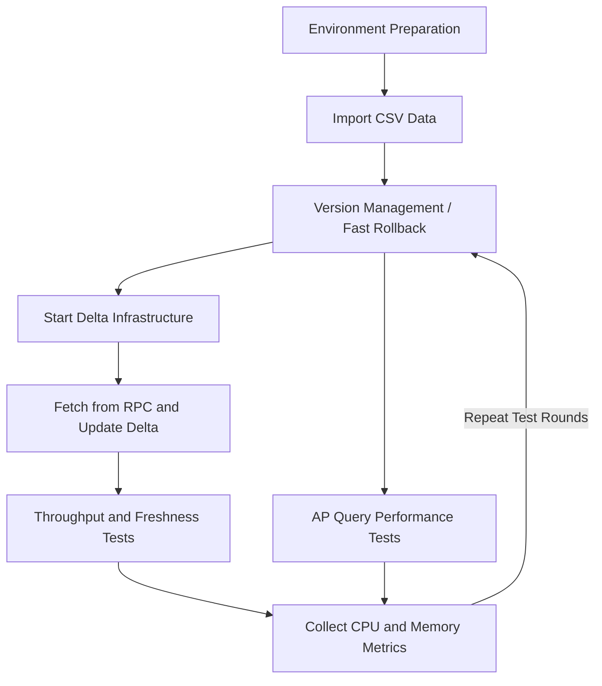

# Delta Lake Test Flow

This document defines a repeatable test workflow for Delta Lake experiments around deployment, ingestion, merge, validation, benchmark runs, and query checks.

It is modeled after the existing Lance test flow used in the same research environment, but adapted to the Delta Lake stack used by `pixels-spark`.

## Workflow



## 1. Environment Preparation

Prepare two layers:

1. Delta infrastructure
2. Pixels CDC merge runtime

Delta infrastructure typically includes:

- object storage
- Hive Metastore
- Trino
- optional Flink Delta writer

Pixels CDC merge runtime includes:

- Java 17
- Spark 3.5.x
- the shaded `pixels-spark` JAR
- a Pixels RPC service
- a Pixels metadata service

Recommended first steps:

```bash
./scripts/build-package.sh
```

Make sure the external Delta infrastructure is already available before running large-scale tests.

## 2. Import CSV Data

Use one of these two input paths:

1. A native Delta demo dataset for infrastructure validation
2. A Pixels-managed source table for CDC merge validation

For CDC merge testing, the source table should:

- exist in the Pixels metadata service
- have a defined primary key
- produce records through the Pixels RPC service

A simple source smoke test:

```bash
mvn -q -DskipTests \
  -Dexec.mainClass=io.pixelsdb.spark.app.PixelsCustomerPullTest \
  -Dexec.args="localhost 9091 pixels_bench savingaccount 0" \
  org.codehaus.mojo:exec-maven-plugin:3.5.0:java
```

## 3. Version Management and Fast Rollback

Delta Lake uses `_delta_log` for versioned table state.

Before each experiment round:

- clean or rotate the target Delta path
- clean or rotate the checkpoint directory
- record the exact target path, checkpoint path, and run timestamp

Recommended practice:

- use a fresh checkpoint path for every benchmark round
- use isolated Delta target paths for different scenarios

Example:

```text
/tmp/pixels-spark-savingaccount-delta-run1
/tmp/pixels-spark-savingaccount-delta-run2
/tmp/pixels-spark-savingaccount-ckpt-run1
/tmp/pixels-spark-savingaccount-ckpt-run2
```

## 4. Start Delta Infrastructure

Before running AP validation or cross-engine checks, confirm that the Delta infrastructure is running:

- object storage
- Hive Metastore
- Trino

Typical checks include:

- storage endpoint reachable
- metastore reachable
- query engine reachable

## 5. Fetch from RPC and Update Delta

The main `pixels-spark` data path is:

```text
Pixels RPC -> Spark Structured Streaming -> foreachBatch -> Delta MERGE
```

Standard merge run:

```bash
./scripts/run-delta-merge.sh \
  --database pixels_bench \
  --table savingaccount \
  --buckets 0 \
  --rpc-host localhost \
  --rpc-port 9091 \
  --metadata-host localhost \
  --metadata-port 18888 \
  --target-path /tmp/pixels-spark-savingaccount-delta \
  --checkpoint-location /tmp/pixels-spark-savingaccount-ckpt \
  --trigger-mode once
```

Default delete behavior:

- `hard delete`

That means:

- the target Delta schema stays aligned with the source schema
- matched delete events physically remove rows

Use `--delete-mode soft` only when the test intentionally requires soft-delete semantics.

## 6. Throughput and Freshness Tests

Key throughput measurements:

- elapsed time per merge run
- records per second
- run-to-run stability

Key freshness measurements:

- source event time
- merge completion time
- query visibility time

Benchmark helper:

```bash
./scripts/benchmark-delta-merge.sh \
  3 \
  pixels_bench \
  savingaccount \
  0 \
  localhost \
  9091 \
  localhost \
  18888 \
  /tmp/pixels-spark-savingaccount-delta \
  /tmp/pixels-spark-benchmark-ckpt \
  --trigger-mode once
```

The script reports:

- `run=<n>`
- `start_ts=<unix_ts>`
- `elapsed_seconds=<n>`

## 7. AP Query Performance Tests

AP tests focus on the Delta table after ingest or merge, not on the merge job itself.

Recommended method:

1. complete a Delta write or merge round
2. query the resulting Delta table from the query engine
3. repeat across data scales or versions

Typical focus:

- single-query latency
- scan behavior after repeated merges
- stability across repeated test rounds

## 8. CPU and Memory Collection

Collect at least:

- CPU
- RSS or heap usage
- disk I/O
- Spark driver and executor logs
- query-engine logs

Minimal tools:

```bash
top
htop
pidstat -r -u -d 1
```

For formal experiments, store:

- run parameters
- target path
- checkpoint path
- timestamps
- system metrics

## 9. Validation Checklist After Each Run

After every run, verify:

1. the Delta table is readable
2. primary keys are still unique
3. target schema matches the intended mode
4. delete behavior matches the configured mode

Available helper scripts:

```bash
./scripts/preview-delta-table.sh /tmp/pixels-spark-savingaccount-delta 5 local[1]
./scripts/check-delta-primary-key.sh localhost 18888 pixels_bench savingaccount /tmp/pixels-spark-savingaccount-delta local[1]
./scripts/acceptance-delta-merge.sh \
  pixels_bench savingaccount 0 localhost 9091 localhost 18888 \
  /tmp/pixels-spark-savingaccount-delta \
  /tmp/pixels-spark-savingaccount-ckpt
```

Primary validation rule:

```text
row_count == distinct_pk_count
```

## 10. Recommended Execution Order

1. verify infrastructure availability
2. run a Pixels source smoke test
3. run one Delta merge job
4. validate primary-key uniqueness
5. run repeated benchmark rounds
6. run AP query checks
7. collect CPU and memory data
8. rotate or roll back target paths and checkpoints before the next round

## 11. Related Documents

- [Project README](../README.md)
- [Native Delta Lake Deployment](DELTA_LAKE_NATIVE_DEPLOYMENT.md)
