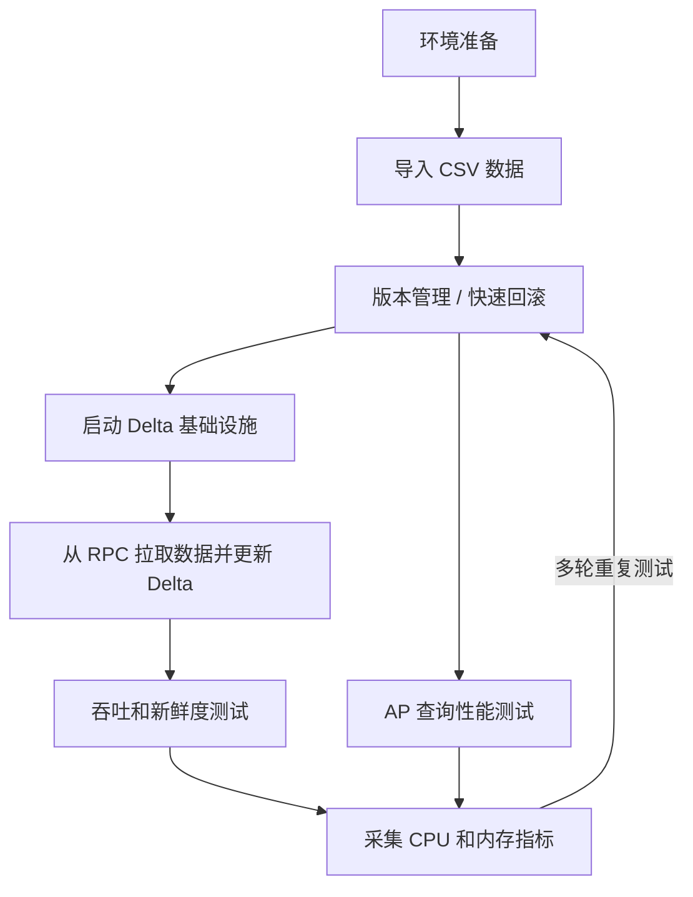

# Delta Lake 测试流程

本文档定义了一套可重复执行的 Delta Lake 测试工作流，覆盖部署、导入、merge、校验、benchmark 和查询验证。

它参考了同一研究环境中已有的 Lance 测试流程，但针对 `pixels-spark` 所使用的 Delta Lake 技术栈进行了调整。

## 工作流



## 1. 环境准备

需要准备两层环境：

1. Delta 基础设施
2. Pixels CDC merge 运行环境

Delta 基础设施通常包括：

- 对象存储
- Hive Metastore
- Trino
- 可选的 Flink Delta writer

Pixels CDC merge 运行环境包括：

- Java 17
- Spark 3.5.x
- `pixels-spark` 的 shaded JAR
- Pixels RPC 服务
- Pixels metadata service

说明：

- 当前 CDC 的 schema 和主键定义不再从 Pixels metadata service 动态拉取
- 这些定义来自仓库内的 benchmark 资源文件：
  - [src/main/resources/benchmarks/hybench.properties](../src/main/resources/benchmarks/hybench.properties)
  - [src/main/resources/benchmarks/chbenchmark.properties](../src/main/resources/benchmarks/chbenchmark.properties)
- metadata service 仍然可以作为运行环境组件存在，但不再承担 CDC schema / 主键解析职责

建议先执行：

```bash
./scripts/build-package.sh
```

在开始大规模测试之前，应先确保外部 Delta 基础设施可用。

## 2. 导入 CSV 数据

这一步把 `pixels-benchmark/Data_1x` 下的基准 CSV 文件导入为 Delta 表。

进入本步骤的表：

- `customer`
- `company`
- `savingAccount`
- `checkingAccount`
- `transfer`
- `checking`
- `loanapps`
- `loantrans`

明确不进入本步骤的文件：

- `blocked_checking.csv`
- `blocked_transfer.csv`

相关文件：

- DDL 模板：`pixels-benchmark/conf/ddl_deltalake.sql`
- Spark SQL 导入模板：`pixels-benchmark/conf/load_data_deltalake.sql`
- 可执行导入脚本：[scripts/import-benchmark-csv-to-delta.sh](../scripts/import-benchmark-csv-to-delta.sh)
- Java 导入程序：[src/main/java/io/pixelsdb/spark/app/PixelsBenchmarkDeltaImportApp.java](../src/main/java/io/pixelsdb/spark/app/PixelsBenchmarkDeltaImportApp.java)
- benchmark 定义：
  - [src/main/resources/benchmarks/hybench.properties](../src/main/resources/benchmarks/hybench.properties)
  - [src/main/resources/benchmarks/chbenchmark.properties](../src/main/resources/benchmarks/chbenchmark.properties)
- 项目配置文件：[etc/pixels-spark.properties](../etc/pixels-spark.properties)
- Trino Delta catalog 模板：[etc/trino-delta_lake.properties.example](../etc/trino-delta_lake.properties.example)

示例命令：

```bash
./scripts/import-benchmark-csv-to-delta.sh \
  /path/to/pixels-benchmark/Data_1x \
  /tmp/pixels-benchmark-deltalake/data_1x \
  local[1]
```

导入完成后的预期结果：

- 每张基准表对应一个 Delta 表目录
- 每张表目录下都有 `_delta_log`
- 每张表都包含持久列 `_pixels_bucket_id`
- 导入后的行数与源 CSV 一致

当前导入逻辑会按主键计算 `_pixels_bucket_id`，但已经不再使用 Spark `hash()`：

```text
primary-key canonical bytes -> ByteString -> RetinaUtils.getBucketIdFromByteBuffer(...)
```

其中：

- `pixels.spark.delta.hash-bucket.count` 已废弃
- 新的 bucket 数配置来自 `$PIXELS_HOME/etc/pixels.properties`
- 实际配置项是 `node.bucket.num`
- 导入和 CDC 都与 server 使用同一套 bucket 计算方式
- HyBench 和 CHBenCHMark 的表结构、输入文件名、分隔符、主键列统一由 benchmark 定义文件维护

重新导入数据前，建议先确认这些配置：

```properties
pixels.spark.delta.enable-deletion-vectors=true
pixels.spark.import.csv.chunk-rows=2560000
pixels.spark.import.count-rows=false
```

重新导入到本地路径示例：

```bash
./scripts/import-benchmark-csv-to-delta.sh \
  /path/to/pixels-benchmark/Data_1x \
  /tmp/pixels-benchmark-deltalake/data_1x \
  local[1]
```

重新导入到 S3 的单表示例：

```bash
export PIXELS_SPARK_CONFIG=/home/ubuntu/disk1/projects/pixels-spark/etc/pixels-spark.properties

"$SPARK_HOME/bin/spark-submit" \
  --master local[4] \
  --driver-memory 20g \
  --conf spark.sql.extensions=io.delta.sql.DeltaSparkSessionExtension \
  --conf spark.sql.catalog.spark_catalog=org.apache.spark.sql.delta.catalog.DeltaCatalog \
  --conf spark.sql.shuffle.partitions=32 \
  --conf spark.default.parallelism=32 \
  --conf spark.hadoop.fs.s3a.impl=org.apache.hadoop.fs.s3a.S3AFileSystem \
  --conf spark.hadoop.fs.s3a.aws.credentials.provider=com.amazonaws.auth.EnvironmentVariableCredentialsProvider \
  --conf spark.hadoop.fs.s3a.endpoint=s3.us-east-2.amazonaws.com \
  --conf spark.hadoop.fs.s3a.connection.ssl.enabled=true \
  --conf spark.hadoop.fs.s3a.path.style.access=false \
  --class io.pixelsdb.spark.app.PixelsBenchmarkDeltaImportApp \
  ./target/pixels-spark-0.1.jar \
  /home/ubuntu/disk1/hybench_sf1000 \
  s3a://home-zinuo/deltalake/hybench_sf1000 \
  local[4] \
  savingAccount
```

如果要整库重新导入 `sf1000`，直接使用：

```bash
./scripts/run-import-hybench-sf1000.sh
```

如果要导入 CHBenCHMark `w1`，直接使用：

```bash
./scripts/run-import-chbenchmark-w1.sh
```

如果要整库重新导入 `sf10` 到 S3，直接使用：

```bash
./scripts/run-import-hybench-sf10.sh
```

也可以显式指定源目录和目标根目录：

```bash
./scripts/run-import-hybench-sf10.sh \
  /home/ubuntu/disk1/hybench_sf10 \
  s3a://home-zinuo/deltalake/hybench_sf10
```

如果希望在建表时就启用 Deletion Vectors，核心 Delta 表属性是：

```properties
delta.enableDeletionVectors=true
```

本项目通过下面这个配置项控制：

```properties
pixels.spark.delta.enable-deletion-vectors=true
```

它会在两类建表路径上生效：

- CSV 导入建表
- CDC 自动建表

当前导入逻辑默认不会先执行全表 `count()`。

对于大文件，CSV 导入会按：

```properties
pixels.spark.import.csv.chunk-rows=2560000
```

进行分块读取，再循环写入 Delta，以避免额外的全量 `repartition`。

对于已经存在的表，也可以补充执行：

```sql
ALTER TABLE delta.`s3a://home-zinuo/deltalake/hybench_sf10/customer`
SET TBLPROPERTIES ('delta.enableDeletionVectors'='true');
```

`Data_1x` 的已验证行数：

- `customer`: `300000`
- `company`: `2000`
- `savingAccount`: `302000`
- `checkingAccount`: `302000`
- `transfer`: `6000000`
- `checking`: `600000`
- `loanapps`: `600000`
- `loantrans`: `600000`

## 3. 版本管理与快速回滚

Delta Lake 使用 `_delta_log` 维护版本化表状态。

每轮实验前建议：

- 清理或轮换目标 Delta 路径
- 清理或轮换 checkpoint 目录
- 记录 target path、checkpoint path 和运行时间戳

推荐做法：

- benchmark 每轮使用新的 checkpoint 路径
- 不同场景使用独立的 Delta 目标路径

例如：

```text
/tmp/pixels-spark-savingaccount-delta-run1
/tmp/pixels-spark-savingaccount-delta-run2
/tmp/pixels-spark-savingaccount-ckpt-run1
/tmp/pixels-spark-savingaccount-ckpt-run2
```

## 4. 启动 Delta 基础设施

在做 AP 验证或跨引擎校验前，应确认 Delta 基础设施已经启动：

- 对象存储
- Hive Metastore
- Trino

典型检查项：

- 存储端点可达
- metastore 可达
- 查询引擎可达

如果重导了 Delta 表，尤其是：

- 使用了 overwrite 重新导入
- 修改了 partition
- 修改了 `_pixels_bucket_id`
- 切换了目标表目录

则 Trino 侧通常需要重新注册表信息。

## 5. 在 Trino 中注册 Delta 表

推荐将 `sf10` 表注册到：

- `delta_lake.hybench_sf10`

注册前需要确认 Trino 的 `delta_lake` catalog 具备以下能力：

- `delta.register-table-procedure.enabled=true`
- 能访问 Hive Metastore
- 能访问 S3

推荐直接对照仓库模板：

- [etc/trino-delta_lake.properties.example](../etc/trino-delta_lake.properties.example)

如果 Trino 的 `delta_lake.properties` 缺少 S3 配置，注册时可能会报：

```text
No factory for location: s3://home-zinuo/deltalake/hybench_sf10/customer/_delta_log
```

这说明当前 Trino 实例无法读取 S3 上的 Delta log。需要：

- 给当前 Trino 的 `delta_lake.properties` 增加 S3 配置并重启
- 或者临时启动一个带 S3 配置的 Trino 实例来做注册

即使 `SHOW TABLES FROM delta_lake.hybench_sf10` 已经能看到表名，仍然可能在查询时失败，例如：

```text
Error getting snapshot for hybench_sf10.customer
```

这同样说明当前 Trino 实例对 S3 上的 Delta log 读取能力还没有配好。

单表注册示例：

```bash
/home/ubuntu/disk1/opt/trino-cli/trino \
  --server http://127.0.0.1:8080 \
  --execute "CREATE SCHEMA IF NOT EXISTS delta_lake.hybench_sf10;
             DROP TABLE IF EXISTS delta_lake.hybench_sf10.customer;
             CALL delta_lake.system.register_table(
               schema_name => 'hybench_sf10',
               table_name => 'customer',
               table_location => 's3://home-zinuo/deltalake/hybench_sf10/customer'
             )"
```

整库 `sf10` 重新注册示例：

```bash
/home/ubuntu/disk1/opt/trino-cli/trino --server http://127.0.0.1:8080 \
  --execute "CREATE SCHEMA IF NOT EXISTS delta_lake.hybench_sf10"

for table_name in customer company savingaccount checkingaccount transfer checking loanapps loantrans; do
  /home/ubuntu/disk1/opt/trino-cli/trino --server http://127.0.0.1:8080 \
    --execute \"DROP TABLE IF EXISTS delta_lake.hybench_sf10.${table_name}\"
done

/home/ubuntu/disk1/opt/trino-cli/trino --server http://127.0.0.1:8080 \
  --execute \"CALL delta_lake.system.register_table(schema_name => 'hybench_sf10', table_name => 'customer', table_location => 's3://home-zinuo/deltalake/hybench_sf10/customer')\"
/home/ubuntu/disk1/opt/trino-cli/trino --server http://127.0.0.1:8080 \
  --execute \"CALL delta_lake.system.register_table(schema_name => 'hybench_sf10', table_name => 'company', table_location => 's3://home-zinuo/deltalake/hybench_sf10/company')\"
/home/ubuntu/disk1/opt/trino-cli/trino --server http://127.0.0.1:8080 \
  --execute \"CALL delta_lake.system.register_table(schema_name => 'hybench_sf10', table_name => 'savingaccount', table_location => 's3://home-zinuo/deltalake/hybench_sf10/savingaccount')\"
/home/ubuntu/disk1/opt/trino-cli/trino --server http://127.0.0.1:8080 \
  --execute \"CALL delta_lake.system.register_table(schema_name => 'hybench_sf10', table_name => 'checkingaccount', table_location => 's3://home-zinuo/deltalake/hybench_sf10/checkingaccount')\"
/home/ubuntu/disk1/opt/trino-cli/trino --server http://127.0.0.1:8080 \
  --execute \"CALL delta_lake.system.register_table(schema_name => 'hybench_sf10', table_name => 'transfer', table_location => 's3://home-zinuo/deltalake/hybench_sf10/transfer')\"
/home/ubuntu/disk1/opt/trino-cli/trino --server http://127.0.0.1:8080 \
  --execute \"CALL delta_lake.system.register_table(schema_name => 'hybench_sf10', table_name => 'checking', table_location => 's3://home-zinuo/deltalake/hybench_sf10/checking')\"
/home/ubuntu/disk1/opt/trino-cli/trino --server http://127.0.0.1:8080 \
  --execute \"CALL delta_lake.system.register_table(schema_name => 'hybench_sf10', table_name => 'loanapps', table_location => 's3://home-zinuo/deltalake/hybench_sf10/loanapps')\"
/home/ubuntu/disk1/opt/trino-cli/trino --server http://127.0.0.1:8080 \
  --execute \"CALL delta_lake.system.register_table(schema_name => 'hybench_sf10', table_name => 'loantrans', table_location => 's3://home-zinuo/deltalake/hybench_sf10/loantrans')\"
```

注册后检查：

```bash
/home/ubuntu/disk1/opt/trino-cli/trino \
  --server http://127.0.0.1:8080 \
  --execute "SHOW TABLES FROM delta_lake.hybench_sf10"

/home/ubuntu/disk1/opt/trino-cli/trino \
  --server http://127.0.0.1:8080 \
  --execute "SELECT count(*) FROM delta_lake.hybench_sf10.customer"
```

## 6. 从 RPC 拉取数据并更新 Delta

`pixels-spark` 的主链路为：

```text
Pixels RPC -> Spark Structured Streaming -> foreachBatch -> Delta MERGE
```

标准 merge 运行方式：

```bash
./scripts/run-delta-merge.sh \
  --database pixels_bench \
  --table savingaccount \
  --rpc-host localhost \
  --rpc-port 9091 \
  --metadata-host localhost \
  --metadata-port 18888 \
  --target-path /tmp/pixels-spark-savingaccount-delta \
  --checkpoint-location /tmp/pixels-spark-savingaccount-ckpt \
  --trigger-mode once
```

`sink-mode` 现在支持两种模式：

- `delta`
  - 默认模式
  - 正常执行 Delta `MERGE`
- `noop`
  - 只拉取 source 并完成当前批次的 Spark 处理链路
  - 不建表
  - 不做 schema 校验
  - 不执行实际 `MERGE`

只验证拉取与批次大小时，可以这样跑：

```bash
./scripts/run-delta-merge.sh \
  --database pixels_bench \
  --table savingaccount \
  --rpc-host localhost \
  --rpc-port 9091 \
  --metadata-host localhost \
  --metadata-port 18888 \
  --mode polling \
  --trigger-mode processing-time \
  --trigger-interval "10 seconds" \
  --sink-mode noop
```

CDC 模式下 bucket 选择现在是自动的。source 会按 `$PIXELS_HOME/etc/pixels.properties` 中的 `node.bucket.num` 拉全量 bucket，不需要手工传 `--buckets`。

当前 CDC merge 实现会先把一个 bucket batch 拆成三类操作，再分别处理：

- `INSERT` / `SNAPSHOT`
  - 直接 append 到 Delta
- `UPDATE`
  - 单独执行 `MERGE ... WHEN MATCHED UPDATE`
- `DELETE`
  - 单独执行 hard delete 或 soft delete

代码结构也已经重构为：

- 预处理器：负责可选的 `latestPerPrimaryKey(...)` 和三类操作拆分
- 目标表支持层：负责建表、补列、表属性校验
- 操作处理器：`InsertHandler` / `UpdateHandler` / `DeleteHandler`

如果上游已经保证同主键记录顺序和折叠结果，可以关闭：

```properties
pixels.spark.delta.enable-latest-per-primary-key=false
```

CDC 使用哪一套本地 benchmark 定义，由 [etc/pixels-spark.properties](../etc/pixels-spark.properties) 中的配置控制：

```properties
pixels.cdc.benchmark=hybench
```

如果要切换为 CHBenCHMark：

```properties
pixels.cdc.benchmark=chbenchmark
```

补充说明：

- CDC source schema 来自 benchmark 定义文件
- CDC `MERGE` 使用的主键列也来自 benchmark 定义文件
- ImportApp 与 CDC 共用同一套本地定义，避免两条路径上的表结构漂移

默认 delete 行为为：

- `hard delete`

这意味着：

- 目标 Delta schema 与源 schema 保持一致
- 命中的删除事件会物理删除行

只有在实验明确需要软删除语义时，才使用：

```text
--delete-mode soft
```

如果要持续跑 `sf10` 全表 CDC update，推荐直接使用总控脚本：

```bash
./scripts/start-local-cdc-stack.sh
./scripts/run-cdc-hybench-sf10.sh
```

第一条用于拉起依赖服务，第二条用于为每张表启动一个独立的 Spark CDC 作业。

### 6.1 控制 source 单批大小

当前 source 支持在一个微批里循环 `pollEvents()`，直到满足以下任一条件：

- 累计记录数达到 `pixels.spark.source.max-rows-per-batch`
- 连续 `pixels.spark.source.max-wait-ms-per-batch` 毫秒没有新数据

另外，连续空 poll 之间会 sleep `pixels.spark.source.empty-poll-sleep-ms`，避免空转。

推荐配置位置：

- [etc/pixels-spark.properties](../etc/pixels-spark.properties)

配置项：

```properties
pixels.spark.source.max-rows-per-batch=100000
pixels.spark.source.max-wait-ms-per-batch=1000
pixels.spark.source.empty-poll-sleep-ms=100
```

语义说明：

- `max-rows-per-batch`
  - 单批目标行数
- `max-wait-ms-per-batch`
  - 空闲超时
  - 一旦 poll 到新数据，等待时间会重置
- `empty-poll-sleep-ms`
  - 空批轮询间隔

## 7. CDC 监控与系统指标

启动指标采集：

```bash
./scripts/collect-cdc-metrics.sh
```

启动 Web 监控页：

```bash
python3 ./scripts/cdc_web_monitor.py
```

默认地址：

```text
http://127.0.0.1:8084
```

监控页展示三类信息：

1. 依赖服务状态
2. 每张表 CDC 作业状态
3. 整体系统指标

整体系统指标来自：

- `/tmp/hybench_sf10_cdc_metrics/system.csv`
- `/home/ubuntu/disk1/projects/pixels-spark/data/hybench/sf10/resource/resource_cdc.csv`

当前采样字段包括：

- `load1`
- `mem_used_mb`
- `mem_avail_mb`
- `disk_used_pct`
- `net_rx_mbps`
- `net_tx_mbps`
- `disk_read_mbps`
- `disk_write_mbps`

资源 CSV 额外提供一份更接近 `resource_iceberg.csv` 的 JVM 汇总格式：

- `time`
- `cpu`
- `jvm_heap`
- `jvm_managed`
- `jvm_direct`
- `jvm_noheap`
- `net_rx_mbps`
- `net_tx_mbps`
- `disk_read_mbps`
- `disk_write_mbps`

如果要调整输出位置，可以修改：

- `pixels.cdc.resource-dir`
- `pixels.cdc.resource-file`
- `pixels.cdc.network-interface`
- `pixels.cdc.disk-device`

每张表的作业指标来自：

- `/tmp/hybench_sf10_cdc_metrics/<table>.json`
- `/tmp/hybench_sf10_cdc_metrics/<table>.csv`

其中包括：

- `status`
- `pid`
- `cpu`
- `rss_kb`
- `etimes`
- `log_excerpt`

如果你希望从命令行看整机 CPU 和内存，也可以直接使用：

```bash
top
htop
pidstat -r -u -d 1
```

## 8. 吞吐和新鲜度测试

吞吐测试重点关注：

- 每轮 merge 耗时
- records per second
- 运行间稳定性

新鲜度测试重点关注：

- 源事件时间
- merge 完成时间
- 查询可见时间

benchmark 辅助脚本：

```bash
./scripts/benchmark-delta-merge.sh \
  3 \
  pixels_bench \
  savingaccount \
  0 \
  localhost \
  9091 \
  localhost \
  18888 \
  /tmp/pixels-spark-savingaccount-delta \
  /tmp/pixels-spark-benchmark-ckpt \
  --trigger-mode once
```

脚本会输出：

- `run=<n>`
- `start_ts=<unix_ts>`
- `elapsed_seconds=<n>`

## 9. AP 查询性能测试

AP 测试关注的是 Delta 表落地后的查询性能，而不是 merge 作业本身。

建议方法：

1. 完成一轮 Delta 写入或 merge
2. 用查询引擎查询结果表
3. 在不同数据规模或不同版本上重复测试

常见关注点：

- 单查询延迟
- 多轮 merge 后的扫描行为
- 多轮测试之间的稳定性

## 10. CPU 与内存采集

至少采集：

- CPU
- RSS 或 heap 使用
- 磁盘 I/O
- Spark driver / executor 日志
- 查询引擎日志

最小化工具：

```bash
top
htop
pidstat -r -u -d 1
```

如果要做正式实验，建议持久化：

- 运行参数
- 目标路径
- checkpoint 路径
- 时间戳
- 系统指标

## 11. 每轮运行后的校验清单

每一轮之后至少验证：

1. Delta 表可读
2. 主键仍然唯一
3. 目标 schema 符合当前模式
4. delete 行为符合当前配置

可用的辅助脚本：

```bash
./scripts/preview-delta-table.sh /tmp/pixels-spark-savingaccount-delta 5 local[1]
./scripts/check-delta-primary-key.sh localhost 18888 pixels_bench savingaccount /tmp/pixels-spark-savingaccount-delta local[1]
./scripts/acceptance-delta-merge.sh \
  pixels_bench savingaccount 0 localhost 9091 localhost 18888 \
  /tmp/pixels-spark-savingaccount-delta \
  /tmp/pixels-spark-savingaccount-ckpt
```

核心校验规则：

```text
row_count == distinct_pk_count
```

## 12. 推荐执行顺序

1. 检查基础设施可用性
2. 运行 Pixels source 烟测
3. 运行一轮 Delta merge
4. 校验主键唯一性
5. 运行多轮 benchmark
6. 执行 AP 查询检查
7. 采集 CPU 和内存指标
8. 在下一轮前轮换或回滚目标路径和 checkpoint

## 13. 相关文档

- [项目 README](../README.zh-CN.md)
- [原生 Delta Lake 部署](DELTA_LAKE_NATIVE_DEPLOYMENT.zh-CN.md)
