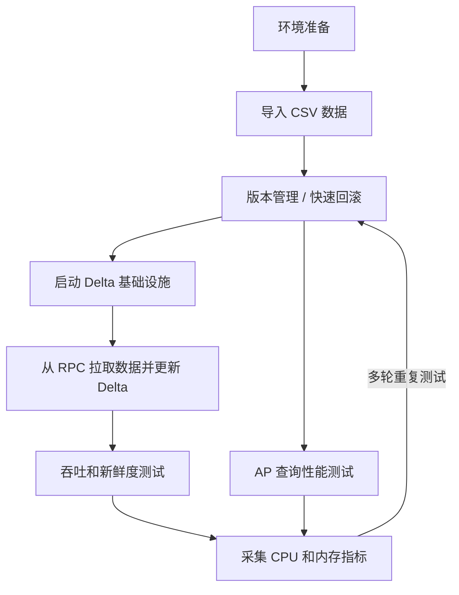

# Delta Lake 测试流程

本文档定义了一套可重复执行的 Delta Lake 测试工作流，覆盖部署、导入、merge、校验、benchmark 和查询验证。

它参考了同一研究环境中已有的 Lance 测试流程，但针对 `pixels-spark` 所使用的 Delta Lake 技术栈进行了调整。

## 工作流



## 1. 环境准备

需要准备两层环境：

1. Delta 基础设施
2. Pixels CDC merge 运行环境

Delta 基础设施通常包括：

- 对象存储
- Hive Metastore
- Trino
- 可选的 Flink Delta writer

Pixels CDC merge 运行环境包括：

- Java 17
- Spark 3.5.x
- `pixels-spark` 的 shaded JAR
- Pixels RPC 服务
- Pixels metadata service

建议先执行：

```bash
./scripts/build-package.sh
```

在开始大规模测试之前，应先确保外部 Delta 基础设施可用。

## 2. 导入 CSV 数据

这一步把 `pixels-benchmark/Data_1x` 下的基准 CSV 文件导入为 Delta 表。

进入本步骤的表：

- `customer`
- `company`
- `savingAccount`
- `checkingAccount`
- `transfer`
- `checking`
- `loanapps`
- `loantrans`

明确不进入本步骤的文件：

- `blocked_checking.csv`
- `blocked_transfer.csv`

相关文件：

- DDL 模板：`pixels-benchmark/conf/ddl_deltalake.sql`
- Spark SQL 导入模板：`pixels-benchmark/conf/load_data_deltalake.sql`
- 可执行导入脚本：[scripts/import-benchmark-csv-to-delta.sh](../scripts/import-benchmark-csv-to-delta.sh)
- S3 导入脚本：[scripts/import-benchmark-csv-to-delta-s3.py](../scripts/import-benchmark-csv-to-delta-s3.py)
- 项目配置文件：[etc/pixels-spark.properties](../etc/pixels-spark.properties)
- Trino Delta catalog 模板：[etc/trino-delta_lake.properties.example](../etc/trino-delta_lake.properties.example)

示例命令：

```bash
./scripts/import-benchmark-csv-to-delta.sh \
  /path/to/pixels-benchmark/Data_1x \
  /tmp/pixels-benchmark-deltalake/data_1x \
  local[1]
```

导入完成后的预期结果：

- 每张基准表对应一个 Delta 表目录
- 每张表目录下都有 `_delta_log`
- 每张表都包含持久列 `_pixels_bucket_id`
- 导入后的行数与源 CSV 一致

当前导入逻辑会按主键计算：

```text
_pixels_bucket_id = pmod(hash(pk), x)
```

其中：

- `x` 来自 `etc/pixels-spark.properties`
- 配置项为 `pixels.spark.delta.hash-bucket.count`

重新导入数据前，建议先确认这个配置值：

```properties
pixels.spark.delta.hash-bucket.count=16
```

重新导入到本地路径示例：

```bash
./scripts/import-benchmark-csv-to-delta.sh \
  /path/to/pixels-benchmark/Data_1x \
  /tmp/pixels-benchmark-deltalake/data_1x \
  local[1]
```

重新导入到 S3 的单表示例：

```bash
export PIXELS_SPARK_CONFIG=/home/ubuntu/disk1/projects/pixels-spark/etc/pixels-spark.properties

"$SPARK_HOME/bin/spark-submit" \
  --master local[4] \
  --driver-memory 20g \
  --conf spark.sql.extensions=io.delta.sql.DeltaSparkSessionExtension \
  --conf spark.sql.catalog.spark_catalog=org.apache.spark.sql.delta.catalog.DeltaCatalog \
  --conf spark.sql.shuffle.partitions=32 \
  --conf spark.default.parallelism=32 \
  --conf spark.hadoop.fs.s3a.impl=org.apache.hadoop.fs.s3a.S3AFileSystem \
  --conf spark.hadoop.fs.s3a.aws.credentials.provider=com.amazonaws.auth.EnvironmentVariableCredentialsProvider \
  --conf spark.hadoop.fs.s3a.endpoint=s3.us-east-2.amazonaws.com \
  --conf spark.hadoop.fs.s3a.connection.ssl.enabled=true \
  --conf spark.hadoop.fs.s3a.path.style.access=false \
  ./scripts/import-benchmark-csv-to-delta-s3.py \
  /home/ubuntu/disk1/hybench_sf1000 \
  s3a://home-zinuo/deltalake/hybench_sf1000 \
  savingAccount
```

如果要整库重新导入 `sf1000`，直接使用：

```bash
./scripts/run-import-hybench-sf1000.sh
```

如果要整库重新导入 `sf10` 到 S3，直接使用：

```bash
./scripts/run-import-hybench-sf10.sh
```

也可以显式指定源目录和目标根目录：

```bash
./scripts/run-import-hybench-sf10.sh \
  /home/ubuntu/disk1/hybench_sf10 \
  s3a://home-zinuo/deltalake/hybench_sf10
```

如需临时覆盖配置文件里的 bucket 数，也可以单独指定：

```bash
export PIXELS_IMPORT_HASH_BUCKET_COUNT=32
```

`Data_1x` 的已验证行数：

- `customer`: `300000`
- `company`: `2000`
- `savingAccount`: `302000`
- `checkingAccount`: `302000`
- `transfer`: `6000000`
- `checking`: `600000`
- `loanapps`: `600000`
- `loantrans`: `600000`

## 3. 版本管理与快速回滚

Delta Lake 使用 `_delta_log` 维护版本化表状态。

每轮实验前建议：

- 清理或轮换目标 Delta 路径
- 清理或轮换 checkpoint 目录
- 记录 target path、checkpoint path 和运行时间戳

推荐做法：

- benchmark 每轮使用新的 checkpoint 路径
- 不同场景使用独立的 Delta 目标路径

例如：

```text
/tmp/pixels-spark-savingaccount-delta-run1
/tmp/pixels-spark-savingaccount-delta-run2
/tmp/pixels-spark-savingaccount-ckpt-run1
/tmp/pixels-spark-savingaccount-ckpt-run2
```

## 4. 启动 Delta 基础设施

在做 AP 验证或跨引擎校验前，应确认 Delta 基础设施已经启动：

- 对象存储
- Hive Metastore
- Trino

典型检查项：

- 存储端点可达
- metastore 可达
- 查询引擎可达

如果重导了 Delta 表，尤其是：

- 使用了 overwrite 重新导入
- 修改了 partition
- 修改了 `_pixels_bucket_id`
- 切换了目标表目录

则 Trino 侧通常需要重新注册表信息。

## 5. 在 Trino 中注册 Delta 表

推荐将 `sf10` 表注册到：

- `delta_lake.hybench_sf10`

注册前需要确认 Trino 的 `delta_lake` catalog 具备以下能力：

- `delta.register-table-procedure.enabled=true`
- 能访问 Hive Metastore
- 能访问 S3

推荐直接对照仓库模板：

- [etc/trino-delta_lake.properties.example](../etc/trino-delta_lake.properties.example)

如果 Trino 的 `delta_lake.properties` 缺少 S3 配置，注册时可能会报：

```text
No factory for location: s3://home-zinuo/deltalake/hybench_sf10/customer/_delta_log
```

这说明当前 Trino 实例无法读取 S3 上的 Delta log。需要：

- 给当前 Trino 的 `delta_lake.properties` 增加 S3 配置并重启
- 或者临时启动一个带 S3 配置的 Trino 实例来做注册

即使 `SHOW TABLES FROM delta_lake.hybench_sf10` 已经能看到表名，仍然可能在查询时失败，例如：

```text
Error getting snapshot for hybench_sf10.customer
```

这同样说明当前 Trino 实例对 S3 上的 Delta log 读取能力还没有配好。

单表注册示例：

```bash
/home/ubuntu/disk1/opt/trino-cli/trino \
  --server http://127.0.0.1:8080 \
  --execute "CREATE SCHEMA IF NOT EXISTS delta_lake.hybench_sf10;
             DROP TABLE IF EXISTS delta_lake.hybench_sf10.customer;
             CALL delta_lake.system.register_table(
               schema_name => 'hybench_sf10',
               table_name => 'customer',
               table_location => 's3://home-zinuo/deltalake/hybench_sf10/customer'
             )"
```

整库 `sf10` 重新注册示例：

```bash
/home/ubuntu/disk1/opt/trino-cli/trino --server http://127.0.0.1:8080 \
  --execute "CREATE SCHEMA IF NOT EXISTS delta_lake.hybench_sf10"

for table_name in customer company savingaccount checkingaccount transfer checking loanapps loantrans; do
  /home/ubuntu/disk1/opt/trino-cli/trino --server http://127.0.0.1:8080 \
    --execute \"DROP TABLE IF EXISTS delta_lake.hybench_sf10.${table_name}\"
done

/home/ubuntu/disk1/opt/trino-cli/trino --server http://127.0.0.1:8080 \
  --execute \"CALL delta_lake.system.register_table(schema_name => 'hybench_sf10', table_name => 'customer', table_location => 's3://home-zinuo/deltalake/hybench_sf10/customer')\"
/home/ubuntu/disk1/opt/trino-cli/trino --server http://127.0.0.1:8080 \
  --execute \"CALL delta_lake.system.register_table(schema_name => 'hybench_sf10', table_name => 'company', table_location => 's3://home-zinuo/deltalake/hybench_sf10/company')\"
/home/ubuntu/disk1/opt/trino-cli/trino --server http://127.0.0.1:8080 \
  --execute \"CALL delta_lake.system.register_table(schema_name => 'hybench_sf10', table_name => 'savingaccount', table_location => 's3://home-zinuo/deltalake/hybench_sf10/savingAccount')\"
/home/ubuntu/disk1/opt/trino-cli/trino --server http://127.0.0.1:8080 \
  --execute \"CALL delta_lake.system.register_table(schema_name => 'hybench_sf10', table_name => 'checkingaccount', table_location => 's3://home-zinuo/deltalake/hybench_sf10/checkingAccount')\"
/home/ubuntu/disk1/opt/trino-cli/trino --server http://127.0.0.1:8080 \
  --execute \"CALL delta_lake.system.register_table(schema_name => 'hybench_sf10', table_name => 'transfer', table_location => 's3://home-zinuo/deltalake/hybench_sf10/transfer')\"
/home/ubuntu/disk1/opt/trino-cli/trino --server http://127.0.0.1:8080 \
  --execute \"CALL delta_lake.system.register_table(schema_name => 'hybench_sf10', table_name => 'checking', table_location => 's3://home-zinuo/deltalake/hybench_sf10/checking')\"
/home/ubuntu/disk1/opt/trino-cli/trino --server http://127.0.0.1:8080 \
  --execute \"CALL delta_lake.system.register_table(schema_name => 'hybench_sf10', table_name => 'loanapps', table_location => 's3://home-zinuo/deltalake/hybench_sf10/loanapps')\"
/home/ubuntu/disk1/opt/trino-cli/trino --server http://127.0.0.1:8080 \
  --execute \"CALL delta_lake.system.register_table(schema_name => 'hybench_sf10', table_name => 'loantrans', table_location => 's3://home-zinuo/deltalake/hybench_sf10/loantrans')\"
```

注册后检查：

```bash
/home/ubuntu/disk1/opt/trino-cli/trino \
  --server http://127.0.0.1:8080 \
  --execute "SHOW TABLES FROM delta_lake.hybench_sf10"

/home/ubuntu/disk1/opt/trino-cli/trino \
  --server http://127.0.0.1:8080 \
  --execute "SELECT count(*) FROM delta_lake.hybench_sf10.customer"
```

## 6. 从 RPC 拉取数据并更新 Delta

`pixels-spark` 的主链路为：

```text
Pixels RPC -> Spark Structured Streaming -> foreachBatch -> Delta MERGE
```

标准 merge 运行方式：

```bash
./scripts/run-delta-merge.sh \
  --database pixels_bench \
  --table savingaccount \
  --buckets 0 \
  --rpc-host localhost \
  --rpc-port 9091 \
  --metadata-host localhost \
  --metadata-port 18888 \
  --target-path /tmp/pixels-spark-savingaccount-delta \
  --checkpoint-location /tmp/pixels-spark-savingaccount-ckpt \
  --trigger-mode once
```

默认 delete 行为为：

- `hard delete`

这意味着：

- 目标 Delta schema 与源 schema 保持一致
- 命中的删除事件会物理删除行

只有在实验明确需要软删除语义时，才使用：

```text
--delete-mode soft
```

## 7. 吞吐和新鲜度测试

吞吐测试重点关注：

- 每轮 merge 耗时
- records per second
- 运行间稳定性

新鲜度测试重点关注：

- 源事件时间
- merge 完成时间
- 查询可见时间

benchmark 辅助脚本：

```bash
./scripts/benchmark-delta-merge.sh \
  3 \
  pixels_bench \
  savingaccount \
  0 \
  localhost \
  9091 \
  localhost \
  18888 \
  /tmp/pixels-spark-savingaccount-delta \
  /tmp/pixels-spark-benchmark-ckpt \
  --trigger-mode once
```

脚本会输出：

- `run=<n>`
- `start_ts=<unix_ts>`
- `elapsed_seconds=<n>`

## 8. AP 查询性能测试

AP 测试关注的是 Delta 表落地后的查询性能，而不是 merge 作业本身。

建议方法：

1. 完成一轮 Delta 写入或 merge
2. 用查询引擎查询结果表
3. 在不同数据规模或不同版本上重复测试

常见关注点：

- 单查询延迟
- 多轮 merge 后的扫描行为
- 多轮测试之间的稳定性

## 9. CPU 与内存采集

至少采集：

- CPU
- RSS 或 heap 使用
- 磁盘 I/O
- Spark driver / executor 日志
- 查询引擎日志

最小化工具：

```bash
top
htop
pidstat -r -u -d 1
```

如果要做正式实验，建议持久化：

- 运行参数
- 目标路径
- checkpoint 路径
- 时间戳
- 系统指标

## 10. 每轮运行后的校验清单

每一轮之后至少验证：

1. Delta 表可读
2. 主键仍然唯一
3. 目标 schema 符合当前模式
4. delete 行为符合当前配置

可用的辅助脚本：

```bash
./scripts/preview-delta-table.sh /tmp/pixels-spark-savingaccount-delta 5 local[1]
./scripts/check-delta-primary-key.sh localhost 18888 pixels_bench savingaccount /tmp/pixels-spark-savingaccount-delta local[1]
./scripts/acceptance-delta-merge.sh \
  pixels_bench savingaccount 0 localhost 9091 localhost 18888 \
  /tmp/pixels-spark-savingaccount-delta \
  /tmp/pixels-spark-savingaccount-ckpt
```

核心校验规则：

```text
row_count == distinct_pk_count
```

## 11. 推荐执行顺序

1. 检查基础设施可用性
2. 运行 Pixels source 烟测
3. 运行一轮 Delta merge
4. 校验主键唯一性
5. 运行多轮 benchmark
6. 执行 AP 查询检查
7. 采集 CPU 和内存指标
8. 在下一轮前轮换或回滚目标路径和 checkpoint

## 12. 相关文档

- [项目 README](../README.zh-CN.md)
- [原生 Delta Lake 部署](DELTA_LAKE_NATIVE_DEPLOYMENT.zh-CN.md)
