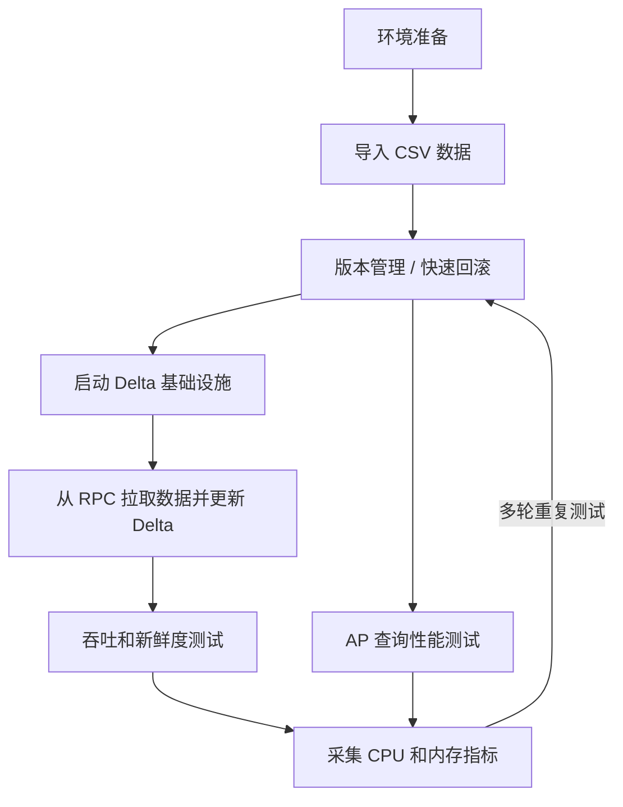

# Delta Lake 测试流程

本文档定义了一套可重复执行的 Delta Lake 测试工作流，覆盖部署、导入、merge、校验、benchmark 和查询验证。

它参考了同一研究环境中已有的 Lance 测试流程，但针对 `pixels-spark` 所使用的 Delta Lake 技术栈进行了调整。

## 工作流



## 1. 环境准备

需要准备两层环境：

1. Delta 基础设施
2. Pixels CDC merge 运行环境

Delta 基础设施通常包括：

- 对象存储
- Hive Metastore
- Trino
- 可选的 Flink Delta writer

Pixels CDC merge 运行环境包括：

- Java 17
- Spark 3.5.x
- `pixels-spark` 的 shaded JAR
- Pixels RPC 服务
- Pixels metadata service

建议先执行：

```bash
./scripts/build-package.sh
```

在开始大规模测试之前，应先确保外部 Delta 基础设施可用。

## 2. 导入 CSV 数据

常见有两种输入路径：

1. 使用原生 Delta demo 数据做基础设施验证
2. 使用 Pixels 管理的源表做 CDC merge 验证

对于 CDC merge 测试，源表应满足：

- 在 Pixels metadata service 中存在
- 已定义主键
- Pixels RPC 服务可以拉到记录

简单的 source 烟测：

```bash
mvn -q -DskipTests \
  -Dexec.mainClass=io.pixelsdb.spark.app.PixelsCustomerPullTest \
  -Dexec.args="localhost 9091 pixels_bench savingaccount 0" \
  org.codehaus.mojo:exec-maven-plugin:3.5.0:java
```

## 3. 版本管理与快速回滚

Delta Lake 使用 `_delta_log` 维护版本化表状态。

每轮实验前建议：

- 清理或轮换目标 Delta 路径
- 清理或轮换 checkpoint 目录
- 记录 target path、checkpoint path 和运行时间戳

推荐做法：

- benchmark 每轮使用新的 checkpoint 路径
- 不同场景使用独立的 Delta 目标路径

例如：

```text
/tmp/pixels-spark-savingaccount-delta-run1
/tmp/pixels-spark-savingaccount-delta-run2
/tmp/pixels-spark-savingaccount-ckpt-run1
/tmp/pixels-spark-savingaccount-ckpt-run2
```

## 4. 启动 Delta 基础设施

在做 AP 验证或跨引擎校验前，应确认 Delta 基础设施已经启动：

- 对象存储
- Hive Metastore
- Trino

典型检查项：

- 存储端点可达
- metastore 可达
- 查询引擎可达

## 5. 从 RPC 拉取数据并更新 Delta

`pixels-spark` 的主链路为：

```text
Pixels RPC -> Spark Structured Streaming -> foreachBatch -> Delta MERGE
```

标准 merge 运行方式：

```bash
./scripts/run-delta-merge.sh \
  --database pixels_bench \
  --table savingaccount \
  --buckets 0 \
  --rpc-host localhost \
  --rpc-port 9091 \
  --metadata-host localhost \
  --metadata-port 18888 \
  --target-path /tmp/pixels-spark-savingaccount-delta \
  --checkpoint-location /tmp/pixels-spark-savingaccount-ckpt \
  --trigger-mode once
```

默认 delete 行为为：

- `hard delete`

这意味着：

- 目标 Delta schema 与源 schema 保持一致
- 命中的删除事件会物理删除行

只有在实验明确需要软删除语义时，才使用：

```text
--delete-mode soft
```

## 6. 吞吐和新鲜度测试

吞吐测试重点关注：

- 每轮 merge 耗时
- records per second
- 运行间稳定性

新鲜度测试重点关注：

- 源事件时间
- merge 完成时间
- 查询可见时间

benchmark 辅助脚本：

```bash
./scripts/benchmark-delta-merge.sh \
  3 \
  pixels_bench \
  savingaccount \
  0 \
  localhost \
  9091 \
  localhost \
  18888 \
  /tmp/pixels-spark-savingaccount-delta \
  /tmp/pixels-spark-benchmark-ckpt \
  --trigger-mode once
```

脚本会输出：

- `run=<n>`
- `start_ts=<unix_ts>`
- `elapsed_seconds=<n>`

## 7. AP 查询性能测试

AP 测试关注的是 Delta 表落地后的查询性能，而不是 merge 作业本身。

建议方法：

1. 完成一轮 Delta 写入或 merge
2. 用查询引擎查询结果表
3. 在不同数据规模或不同版本上重复测试

常见关注点：

- 单查询延迟
- 多轮 merge 后的扫描行为
- 多轮测试之间的稳定性

## 8. CPU 与内存采集

至少采集：

- CPU
- RSS 或 heap 使用
- 磁盘 I/O
- Spark driver / executor 日志
- 查询引擎日志

最小化工具：

```bash
top
htop
pidstat -r -u -d 1
```

如果要做正式实验，建议持久化：

- 运行参数
- 目标路径
- checkpoint 路径
- 时间戳
- 系统指标

## 9. 每轮运行后的校验清单

每一轮之后至少验证：

1. Delta 表可读
2. 主键仍然唯一
3. 目标 schema 符合当前模式
4. delete 行为符合当前配置

可用的辅助脚本：

```bash
./scripts/preview-delta-table.sh /tmp/pixels-spark-savingaccount-delta 5 local[1]
./scripts/check-delta-primary-key.sh localhost 18888 pixels_bench savingaccount /tmp/pixels-spark-savingaccount-delta local[1]
./scripts/acceptance-delta-merge.sh \
  pixels_bench savingaccount 0 localhost 9091 localhost 18888 \
  /tmp/pixels-spark-savingaccount-delta \
  /tmp/pixels-spark-savingaccount-ckpt
```

核心校验规则：

```text
row_count == distinct_pk_count
```

## 10. 推荐执行顺序

1. 检查基础设施可用性
2. 运行 Pixels source 烟测
3. 运行一轮 Delta merge
4. 校验主键唯一性
5. 运行多轮 benchmark
6. 执行 AP 查询检查
7. 采集 CPU 和内存指标
8. 在下一轮前轮换或回滚目标路径和 checkpoint

## 11. 相关文档

- [项目 README](../README.zh-CN.md)
- [原生 Delta Lake 部署](DELTA_LAKE_NATIVE_DEPLOYMENT.zh-CN.md)
